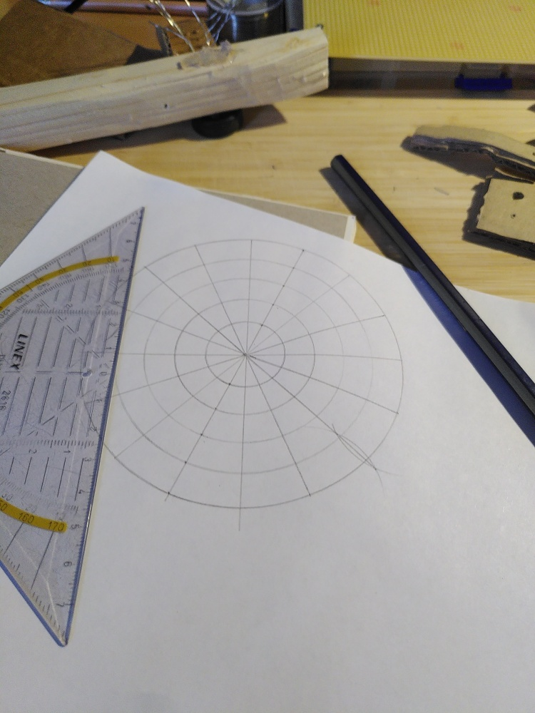
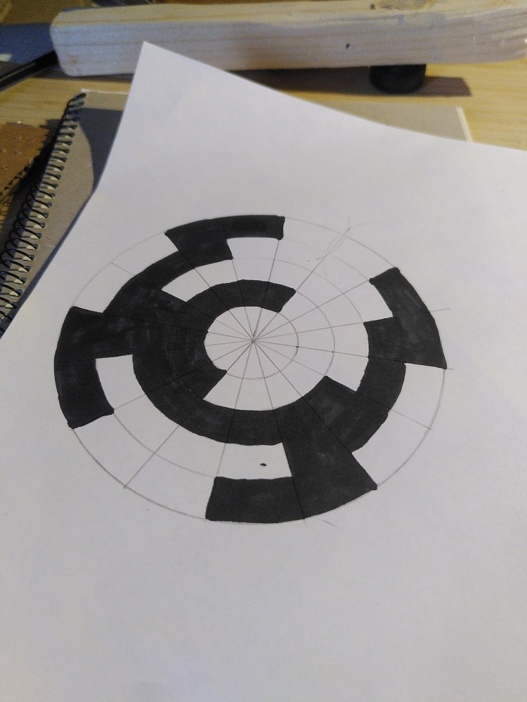
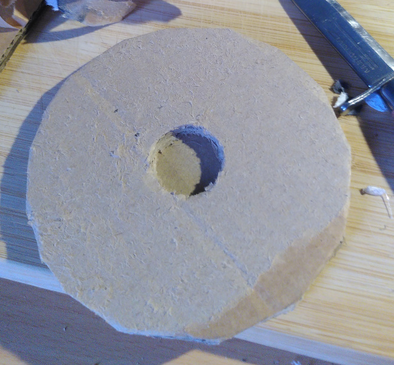
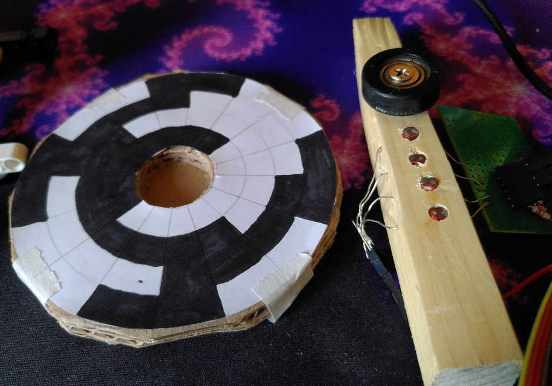

# Cardboard Wind Station
This project is a wind direction sensor made of scraps I happened to have. Feel free to use better and nicer looking materials.

Estimated time: a few hours? idk, depends how neat you want it.

## Objective
The purpose of this device was really just an excuse for me to build a rotary encoder. But I do also want to investigate the feasibility of making a DIY wind turbine for charging things, so the data generated by this could be used to figure out a good location for that. Although wind speed is more relevant than direction.

## Materials & Tools
As previously noted, these materials are just scraps I had, exact measurements and type are not important. If you have access to a 3D printer or laser cutter and MDF, that would likely give a neater result, but you'd have to model the parts first.

- soldering tools
- glue - I used hot glue but [wheat paste might be a better alternative](https://www.youtube.com/watch?v=45JhacvmXV8)
- compass (the drawing tool)
- sharp knife
- black marker
- white paper
- 10kOhm resistor x3
- photoresistor x3 (TODO detail)
- Raspberry Pi Pico W/WH
- bearing 25mm diameter
- large, opaque plastic box
- piece of wood ~2x2x14cm
- 3mm & 5mm drill
- wires

## Construction
### encoder pattern
- draw a circle on white paper big enough to fit the bearing (leaving 1mm of margin is a good idea)
- draw concentric circles around it, increasing the radii by 1cm each time. you need one per sensor (3) (i made 4 because i was planning to use more sensors than i did)
- divide the circles into 8ths
- fill in the section like a [gray code](https://en.wikipedia.org/wiki/Gray_code#Position_encoders) (same as pictured, but skip the outermost circle)


### encoder plate
- Cut 3 pieces of cardboard big to fit the encoder pattern with comfortable margin
- Glue 2 of them together with perpendicular grain directions
- Cut a hole through the center, just big enough to friction-fit the bearing
- Glue the third piece to the others, again with perpendicular grain to the side you stick it to
- Cut the outside into a rough circle, the same size as the encoder pattern
- Attach the patern to the plate on the side with a hole, as concentric as possible. Use masking tape to make it slightly adjustable

### encoder
- Attach the bearing off-center on the wood piece using a wood screw and a large nut or washers to make sure it doesn't scrape against the wood when rotating.
- Drill 5mm holes about 1cm deep for the photoresistors, starting at 5mm from the bearing edge and 1cm apart
- Drill 3mm holes all the way through, perpendicular to and intersecting the 5mm holes, this is for the photoresistor legs
- Solder the components using the diagram below
TODO diagram


## Computer setup
I used VS code but you only need a terminal for building this.

### Pico firmware
Requires the following software: `git`, `make`, `cmake` and a C compiler
```
git clone https://git.crispypin.cc/CrispyPin/wind_station
```
Now edit the file `pico/src/wifi_cred.h` and update the values accordingly.

Finally build it with:
```
cd wind_station/pico
make
```
Then plug in the pico while holding the bootsel button, and copy `pico/bin/wind_station.uf2` onto it.

### Server software
Install [`rust`](https://rustup.rs/), then run `cargo run` in `wind_station/server`

## "Platform"
I chose not to use any premade IoT platform, to reduce external dependencies, security risks and overall energy impact of the system.

I believe that our collective reliance on gigantic tech stacks and corporations is Very Bad, and do my best not to worsen the problem further by handcrafting all my software with as few dependencies as possible.

Further reading: https://permacomputing.net/principles/ :3

## Code
TODO

## Connectivity
Data is sent every TODO seconds over WiFi, using a raw TCP pipe. Since the data is so simple, I figured there was no point using MQTT or HTTP, since I have nothing else to connect to it. A less complicated protocol means marginally lower power usage, and easier implementation without dependencies.

## Presenting the data
TODO
