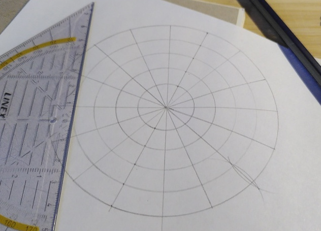
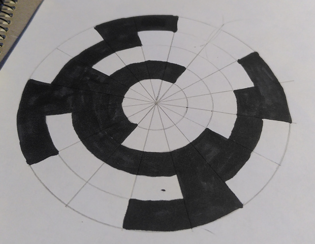
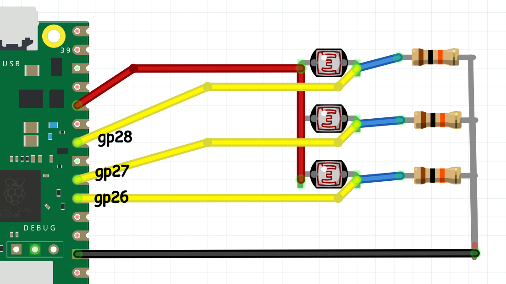
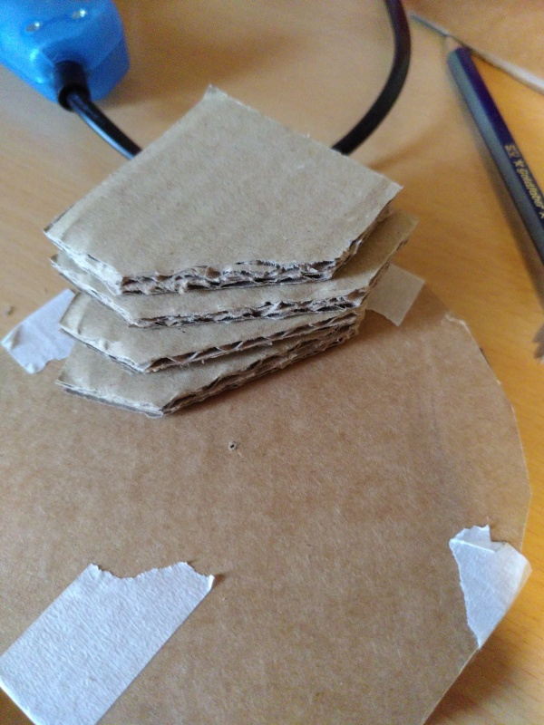
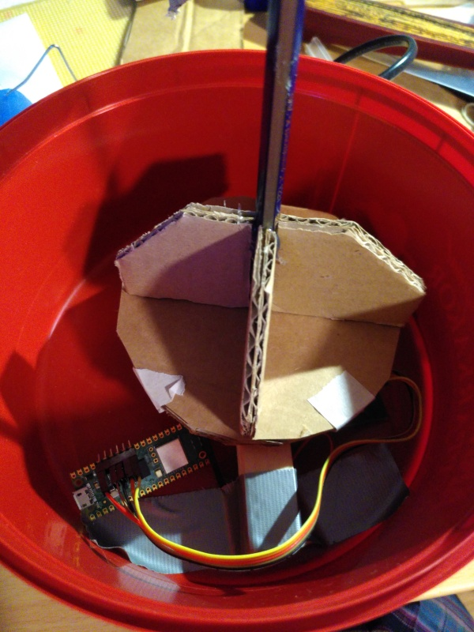
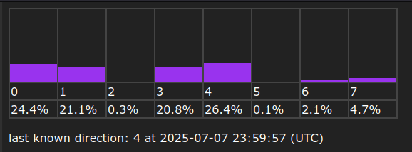

# Cardboard Wind Station
This project is a wind direction sensor made of scraps I happened to have. Feel free to use better and nicer looking materials.

Estimated time: at least a few hours, depending on how neat you want it.

obligatory identification for the peer reviewers: [discord message link](https://discord.com/channels/720703210884563065/835516699263762483/1369758839167123586) (i also have the same nickname and profile pic there so it should be easy to find me)

## Objective
The purpose of this device was really just an excuse for me to build a rotary encoder. But I do also want to investigate the feasibility of making a DIY wind turbine for charging things, so the data generated by this could be used to figure out a good location for that. Although wind speed is more relevant than direction.

## Materials & Tools
As previously noted, these materials are just scraps I had, exact measurements and type are not important. If you have access to a 3D printer or laser cutter and MDF, that would likely give a neater result, but you'd have to model the parts first.

- soldering tools
- glue - I used hot glue but [wheat paste might be a better alternative for the cardboard only joins](https://www.youtube.com/watch?v=45JhacvmXV8)
- compass (the drawing tool)
- sharp knife
- black marker
- white paper
- 10k Ohm resistor x3
- 220 Ohm resistor
- photoresistor x3
- white LED
- Raspberry Pi Pico W/WH
- bearing 25mm diameter
- large, opaque plastic box
- wood block ~2x2x14cm
- 3mm & 5mm drill
- wires

## Computer setup for the Pico firmware
I used VS code but you don't need any extensions for just building this.

Requires the following software: `git`, `make`, `cmake` and a C compiler
```
git clone https://git.crispypin.cc/CrispyPin/wind_station
```
Now edit the file `pico/src/wifi_cred.h` and update the values accordingly.
- note: if you change the port, also change it in `wind_server/src/main.rs`

Finally build it with:
```
cd wind_station/pico
make
```
Then plug in the pico while holding the bootsel button, and copy `pico/bin/wind_station.uf2` onto it.

After establishing a connection to the server (see below), it will start blinking the builtin LED very rapidly for a few seconds. This is the calibration step, manually rotate the sensor a few times to give it readings on what black and white looks like.

## Construction (Putting everything together)
### encoder pattern
- draw a circle on white paper big enough to fit the bearing (leaving 1mm of margin is a good idea)
- draw concentric circles around it, increasing the radii by 1cm each time. you need one per sensor (3) (i made 4 because i was planning to use more sensors than i did)
- divide the circles into 8ths
- fill in the section like a [gray code](https://en.wikipedia.org/wiki/Gray_code#Position_encoders) (same as pictured, but skip the outermost circle)


### encoder plate
- Cut 3 pieces of cardboard big to fit the encoder pattern with comfortable margin
- Glue 2 of them together with perpendicular grain directions
- Cut a hole through the center, just big enough to friction-fit the bearing
- Glue the third piece to the others, again with perpendicular grain to the side you stick it to
- Cut the outside into a rough circle, the same size as the encoder pattern
- Attach the patern to the plate on the side with a hole, as concentric as possible. Use masking tape to make it slightly adjustable

### encoder
- Attach the bearing off-center on the wood piece using a wood screw and a large nut or washers to make sure it doesn't scrape against the wood when rotating.
- Drill 5mm holes about 1cm deep for the photoresistors, starting at 5mm from the bearing edge and 1cm apart
- Drill 3mm holes all the way through, perpendicular to and intersecting the 5mm holes, this is for the photoresistor legs
- Solder the components using the diagram below


## full assembly
It would work better if fully encased in opaque material, and with an always-on white LED near the sensors, but I have not hooked that up yet.



## Platform
I chose not to use any premade IoT platform, to reduce external dependencies, security risks and overall energy impact of the system.

Install [`rust`](https://rustup.rs/), then run `cargo run` in `wind_station/server`.
The server stores data in `saved.txt`, and loads all previous data on startup.

The HTML is mostly generated by the server code, but is inserted into a template (template.html), which contains the styling. It is read every time the page is generated, so you can edit it and see the changes without restarting the server.

When the server is stopped, the pico is supposed to reconnect automatically but I haven't managed to get that to work, so you have to reboot it too, and redo the calibration

I believe that our collective reliance on gigantic tech stacks and corporations is Very Bad, and do my best not to worsen the problem further by handcrafting all my software with as few dependencies as possible.

Further reading: https://permacomputing.net/principles/ :3

## Code
I have used only the official pico C sdk, and the networking libraries included in it (cyw43 driver and lwip).

Each light sensor (photoresistor) is used as a binary bit, following gray code rather than normal binary. Conversion to regular numbers is done with a lookup table.

In the calibration step, it records the highest and lowest values seen by all 3 sensors, then sets activation thresholds at the two thirds points between (for example, lowest reading 100 and highest 400 gives activation thresholds of 200 and 300). This means there's a dead zone in between where it won't change the value of that bit.

The main loop of the program takes measurements at a fixed interval, then sends the data in batches:
```c
calibrate_brightness();
u32 next_measurement_time = time_us_64();
while (true) {
	sleep_until(next_measurement_time);
	next_measurement_time += MEASURE_INTERVAL_MS * 1000; // millis to micros
	update_encoder_value();
	packet_data[packet_fill++] = rotary_encoder_directon + '0'; // convert number to ascii digit
	if (packet_fill == DATA_PER_PACKET){
		send_data();
		packet_fill = 0;
	}
}
```

## Connectivity
Data is sent every 5 seconds over WiFi, using a plain TCP pipe. Since the data is so simple, I figured there was no point using MQTT or HTTP, since I have nothing else that will use the data. A less complicated protocol means marginally lower power usage, and easier implementation without external dependencies.

## Presenting the data
Currently just shows a distribution of what directions are most common, and the last known direction with a timestamp.

I'm using a text file instead of a database because a database is overly complex for something this small. (Though if I intended to run this for longer periods of time, I'd at least make it write to disk less frequently).
The total amount of storage used is about 1MB per day, but it could be compressed quite easily.


## Finalizing the design
The most important thing I didn't get around to is installing the LED inside, which means it can't work over a long time without calibration and external light. I also initially wanted to have a wind speed sensor too, but didn't have time. If I continue this project, I will add another bit of precision to the direction sensor with some extra logic components.

Rain is also something I didn't consider enough. I ended up putting a roof over the thing but it's not very good.

I think I simply didn't put enough time into it, due to being busy and/or tired from moving homes at the same time.

